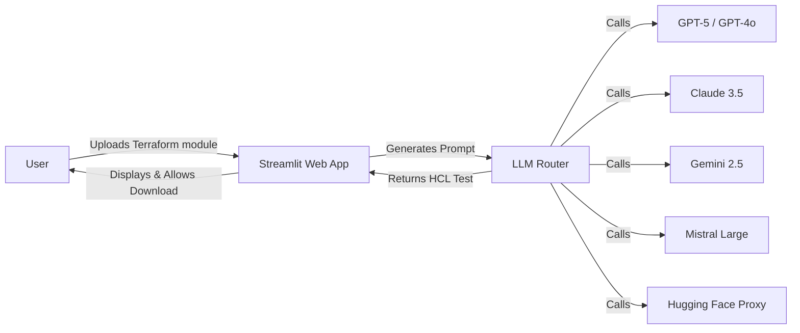
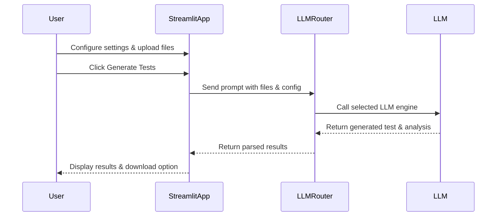

# Terraform LLM Test Generator - User Guide

## 1. Overview
The **Terraform LLM Test Generator** is a Streamlit-based tool designed to automatically generate test cases (`.tftest.hcl`) for Terraform modules. It leverages multiple Large Language Models (LLMs) including GPT, Claude, Gemini, Mistral, and Hugging Face models to analyze Terraform code and produce structured, runnable test cases or mock simulations.

Key Features:
- Multi-cloud support (Azure, GCP, and others)
- Supports multiple LLM engines for test generation
- Generates both mock (simulated) and real (runnable) Terraform tests
- Provides detailed coverage and improvement suggestions
- Offers a user-friendly Streamlit web interface

---

## 2. System Architecture



Components:
- **Streamlit Web App**: Provides UI for configuration, file upload, and test results display.
- **LLM Router**: Routes prompts to the selected LLM engine and retrieves the response.
- **LLM Engines**: Executes code analysis and generates test cases.
- **HCL Parser**: Extracts code, coverage, and suggestions from LLM output.

---

## 3. System Flow with User Interaction

1. **User opens the app** via `terraform-llm-testgen` command.
2. **User configures** cloud provider, service, test coverage, LLM engine, and test mode.
3. **User uploads Terraform module files** (`main.tf`, `variables.tf`, `outputs.tf`).
4. **User clicks Generate Tests**.
5. **System generates tests**:
   - Mock Test: Returns simulated `.tftest.hcl` with placeholder values.
   - Real Test: Returns runnable HCL test cases analyzed by the selected LLM.
6. **System parses LLM output** for HCL code, coverage, and improvement suggestions.
7. **User views results** in Streamlit interface and can download the generated `.tftest.hcl` file.

---

## 4. Sequence Diagram



---

## 5. Build and Installation

### Requirements
- Python 3.11+
- pip
- Streamlit and other dependencies (included in `install_requires`)

### Installation from Wheel

1. Install the wheel:
```bash
pip install dist/terraform_llm_testgen-3.2-py3-none-any.whl
```
2. Run the app:
```bash
terraform-llm-testgen
```
3. The Streamlit interface will open in the default browser.

### Development Installation

```bash
git clone <repository_url>
cd terraform_llm_testgen
pip install -e .
```
## Environment Variables

Set your LLM API keys before use:

### Windows (PowerShell)
```powershell
setx GOOGLE_API_KEY "your_google_key"
setx OPENAI_API_KEY "your_openai_key"
setx ANTHROPIC_API_KEY "your_anthropic_key"
setx MISTRAL_API_KEY "your_mistral_key"
```

### Linux / macOS
```bash
export GOOGLE_API_KEY="your_google_key"
export OPENAI_API_KEY="your_openai_key"
export ANTHROPIC_API_KEY="your_anthropic_key"
export MISTRAL_API_KEY="your_mistral_key"
```

Run with:
```bash
streamlit run terraform_llm_testgen/app.py
```

---

## 6. Risk Metrics

The system provides **risk metrics** associated with Terraform test generation:
- **Coverage Risk**: Indicates potential gaps in test coverage.
- **Mock vs Real Risk**: Mock tests simulate environment; real tests may fail due to misconfigurations.
- **LLM Interpretation Risk**: Accuracy depends on selected LLM and prompt quality.

These metrics are visualized in the app as colored coverage indicators:
- Green (>= 75%): Low risk
- Orange (50-74%): Moderate risk
- Red (<50%): High risk

---

## 7. Traceability Metrics

The system tracks **traceability** for Terraform resources and variables:
- Lists resources detected in uploaded modules
- Lists input variables and outputs referenced
- Maps generated test cases to specific resources and variables
- Provides suggestions for improving traceability

This ensures generated tests are linked to real infrastructure components and helps in audit and verification.

---

